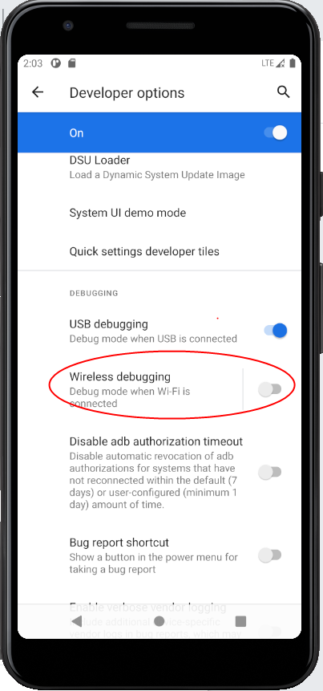
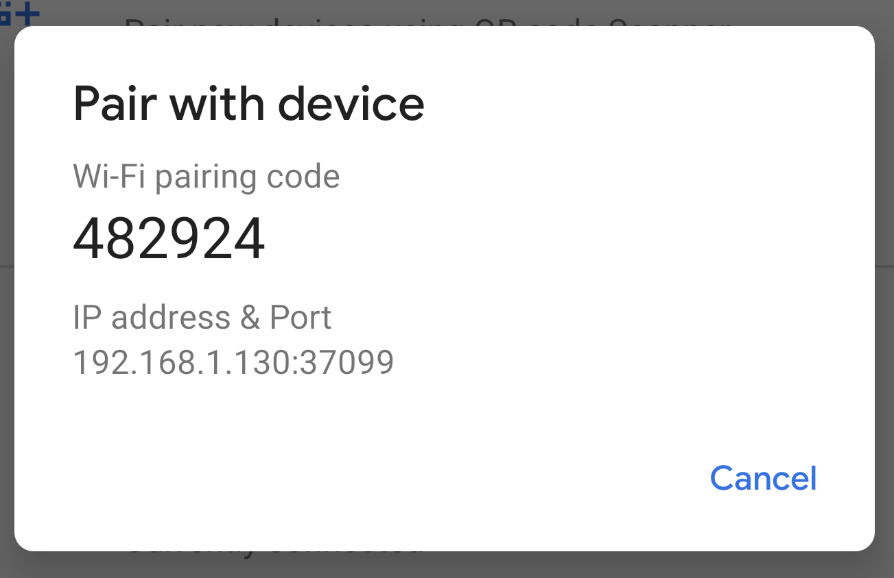
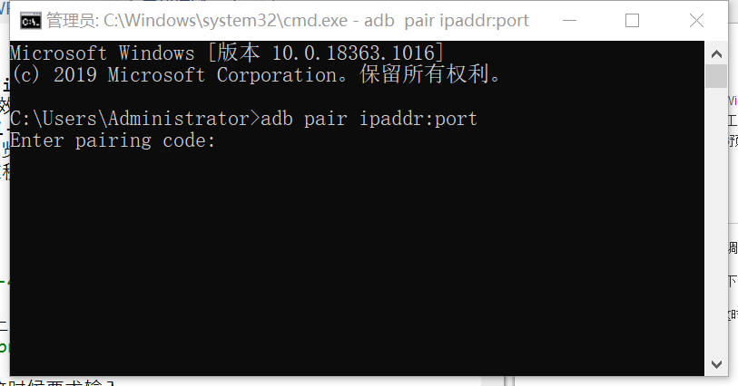
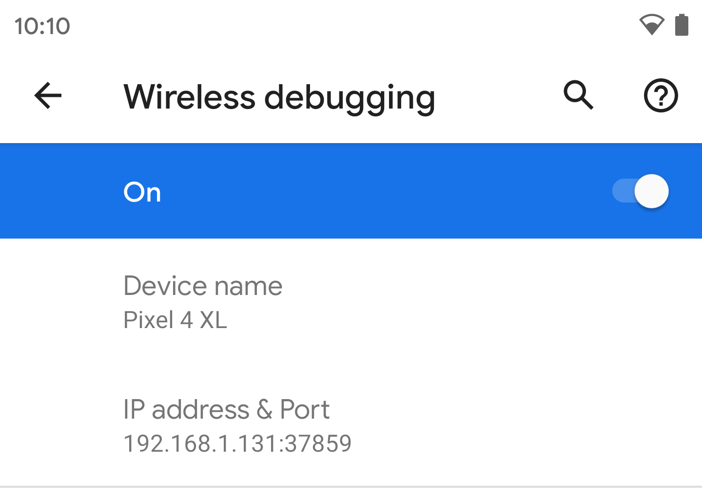

# 无线调试★

在无线除错上，Android 11更新以Wi-Fi连接使用ADB改善除错体验，Google提到，笔记本上的USB孔数有限，利用无线除错功能可以有效提升开发者的工作效率，与目前TCP/IP除错工作流程不同，不需要线材连接，而是使用最新的Wi-Fi标准进行高速传输，系统可以在一段时间内记住无线连接。开发者在Android 11开发者第3预览版，已经可以利用配对代码的方式，开始使用无线除错，而之后Android Studio会增加二维秒扫描配对，整合无线除错的体验。

##使用流程

1. 首先在开发者选项中打开无线调试

	

1. 选择使用配对码配对设备。记下设备上显示的配对码、IP 地址和端口号
	
	

1. 运行 adb pair ipaddr:port ，这时候要求输入配对码
	
	

1. 当系统提示时，输入您在第 5 步中获得的配对码。系统会显示一条消息，表明您的设备已成功配对。
	```
	Enter pairing code: 482924
	Successfully paired to 192.168.1.130:37099 [guid=adb-235XY]
	```
1. 运行 adb connect ipaddr:port
	

由于模拟器上无法连接wifi，所以无法验证，所以请自行验证。最大的改动就是android 11以前需要用usb连接一次电脑才能进行无线调试，现在可以在完全无线的情况下进行调试。