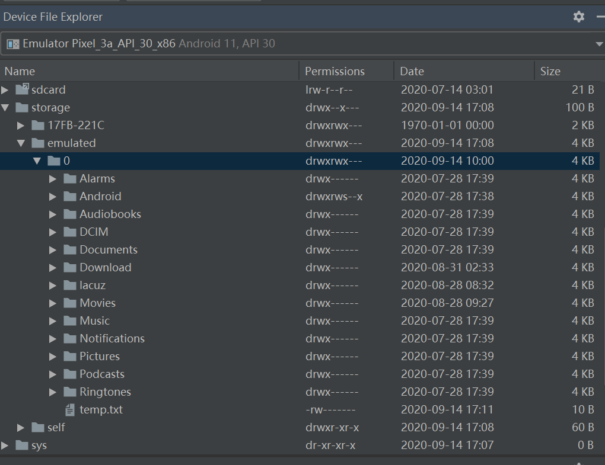
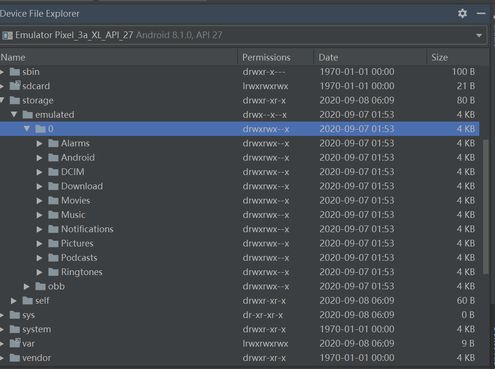
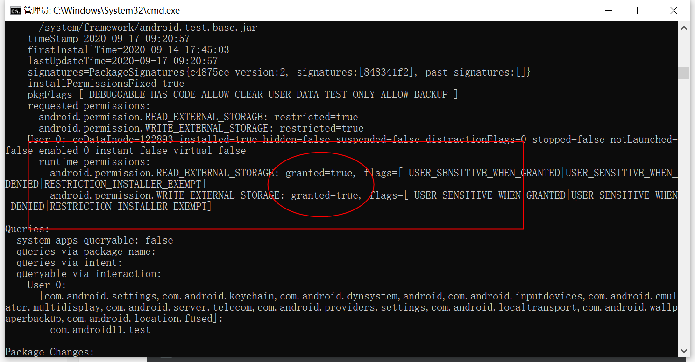
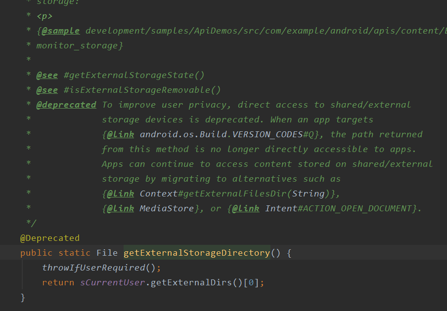
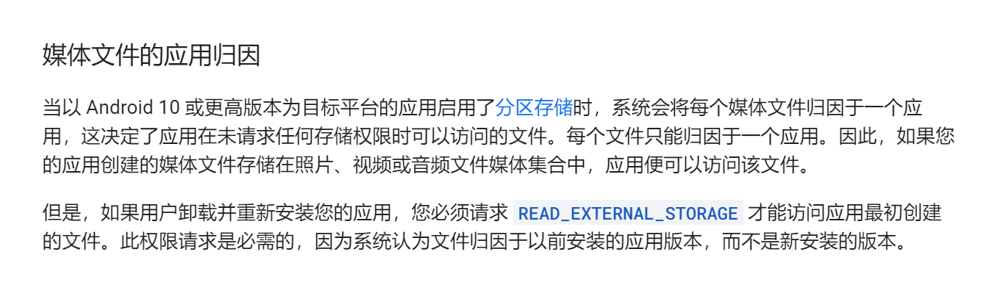

# 什么是分区存储？
事情得从Android 10说起，首次引入了分区存储，类似ios的沙盒机制，应用**不可以随意访问外部存储区**中的文件。google没有强制性使用，同时给出清单配置属性requestLegacyExternalStorage = true来避免伤及无辜，这样就可以采用原有的存储策略。但在Android 11中，而同时你的应用targetSdkVersion = 30的话，就会忽略此配置属性，强制使用分区存储。另外android 11提供preserveLegacyExternalStorage属性，当用户升级到以 Android 11 为目标平台的新版应用时，可以保留旧版存储模型。

反正android11的意思就是：

* targetSdkVersion 小于29的应用，可以忽略
* targetSdkVersion 等于29的应用，选择性进行分区存储
* targetSdkVersion 大于29的应用，必须进行分区存储


分区存储策略下应用只能访问外存储以下两种目录。

+ 私有目录
	- 私有目录不需要权限就能访问
	- 目录一般在(/storage/emulated/0/Android/data/包名/)
	```
		//分区存储空间
		val file = File(context.filesDir, filename)
		//应用专属外部存储空间
		val appSpecificExternalDir = File(context.getExternalFilesDir(), filename)
	```
	
+ 共享目录
	- 包含媒体文件、文档文件以及其他文件，对应设备DCIM、Pictures、Alarms, Music, Notifications,Podcasts, Ringtones、Movies、Download等目录。
	- 通过MediaStore API访问媒体文件,访问其他应用创建的媒体文件需要权限。
	- 通过Storage Access Framework方式访问其他应用创建的非媒体文件。


## 文件属性变化



可以看出对比android8.1,在android 11系统的模拟器上，外部存储DCIM、Download、Pictures等目录权限已经变为drwxr-----，也就是说，除了文件所有者，其他用户只有Read的权限。（[Linux文件知识恶补](https://www.cnblogs.com/woods1815/p/11026967.html)）


---

# 验证分区存储

以下从三种方式进行分区存储验证，以及可能用到的文件操作方式

* 外存储非共享目录下创建文件
* 外存储非共享目录下读写迁移文件
* 共享目录下创建和读取文件

## 测试准备
### 测试分区存储
如需在您的应用中启用分区存储，而不考虑应用的目标 SDK 版本和清单标记值，请启用以下应用兼容性标记：

* DEFAULT_SCOPED_STORAGE（默认情况下，对所有应用处于启用状态）
* FORCE_ENABLE_SCOPED_STORAGE（默认情况下，对所有应用处于停用状态）
如需停用分区存储而改用旧版存储模型，请取消设置这两个标记。


### 权限授予
为了方便调试，可以使用pm命令进行权限授予，记得清单文件中也要声明。

```
//授权 pm grant 包名 权限名
adb shell pm grant com.android11.test android.permission.WRITE_EXTERNAL_STORAGE

//取消授权 
adb shell pm revoke com.android11.test android.permission.WRITE_EXTERNAL_STORAGE

//查看应用授权信息
adb shell dumpsys package com.android11.test

```



## 外存储非共享目录下创建文件
外存储非共享目录在分区存储策略下是不给创建的，所以我们要避免在这些目录下创建文件。但是官方为了给时间缓冲，提供了并且requestLegacyExternalStorage和preserveLegacyExternalStorage来适配，基本上搞懂这两个属性的使用，就基本搞懂分区存储适配。

### getExternalStorageDirectory弃用


getExternalStoragePublicDirectory和getExternalStorageDirectory在android 11已经被被弃用，直接调用的话：

* 在targetSDkVersion 等于30，模拟器调用时getExternalStorageDirectory，返回
*/storage/emulated/0*
* 在targetSDkVersion 等于28，模拟器调用时getExternalStorageDirectory，返回*/storage/emulated/0*

也就是说虽然被弃用，但是返回依然和之前的路径一样。

### 权限影响

在没有WRITE_EXTERNAL_STORAGE权限的情况下，无论targetSDKVersion是多少，在外存储非共享目录下创建文件都是报错的。（这里说的情况不包括6.0以下）

### 创建文件
在取得WRITE_EXTERNAL_STORAGE权限情况下，使用以下代码再**android11的模拟器上**创建.txt文件作为示例

```kotlin

     private fun createFile(){
		//getExternalStorageDirectory被弃用，分区存储开启后就不允许访问了
        val tempFilePath = Environment.getExternalStorageDirectory().absolutePath
        val newFile = File(tempFilePath + File.separator.toString() + "temp.txt")
        if(!newFile.exists()){
            newFile.createNewFile()
        }
        var os: OutputStream? = null
        try {
            os = FileOutputStream(newFile)
            os?.write("Hello Work".toByteArray())
            os?.flush()
            Log.i("TAG","create file success")
        } catch (e: IOException) {
            e.printStackTrace()
        } finally {
            os?.close()
        }

    }

```

* 当targetSDkVersion = 28,创建成功
* 当targetSDkVersion = 29,创建失败，提示Operation not permitted
* 当targetSDkVersion = 29,并且requestLegacyExternalStorage="true",创建成功
* 当targetSDkVersion = 29,并且requestLegacyExternalStorage="true",卸载重新安装，创建成功
* 当targetSDkVersion = 30,创建失败，提示Operation not permitted
* 当targetSDkVersion = 30,并且requestLegacyExternalStorage="true",创建失败
* 当targetSDkVersion = 30,并且由targetSDKVersion=28直接升级覆盖，设置preserveLegacyExternalStorage=true，创建成功
* 当targetSDkVersion = 30,preserveLegacyExternalStorage=true，卸载重新安装，创建失败

由此而得出结论，当targetSDKVersion=29的时候，如果不设置requestLegacyExternalStorage属性，使用分区存储，应用无权限访问外部非共享目录。而在targetSDkVersion = 30的时候，系统已经强制使用分区存储，故而无法再在外存储非共享目录下创建文件了。preserveLegacyExternalStorage的作用是保留安装前应用使用的存储策略，如果应用是卸载安装的，这个属性就会失效。

## 外存储非共享目录下读写文件
假设，应用未升级之前，targetSDkVersion = 28时已经创建文件temp.txt,使用下面示例代码读取

```kotlin
	private fun readFile() {
        val tempFilePath = Environment.getExternalStorageDirectory().absolutePath
        val file = File(tempFilePath + File.separator.toString() + "temp.txt")
        if (!file.exists()) {
            Log.i("TAG", "file is no exist")
        }
        var content = "";
        try {
            var instream = FileInputStream(file);
            var inputreader = InputStreamReader(instream);
            var buffreader = BufferedReader(inputreader);
            var read: String? = null
            while ({ read = buffreader.readLine();read }() != null) {
                content = content + read + "\r\n"
            }
            instream.close();
            Log.i("TAG",content)
        } catch (e: IOException) {
            e.printStackTrace()
        }
    }

```


在取得READ存储权限情况下，进行应用升级后，

* 当升级后的targetSDkVersion = 28,读取成功
* 当升级后的targetSDkVersion = 29,读取成功
* 当升级后的targetSDkVersion = 30,读取成功
* 卸载再重新安装应用，targetSDkVersion = 29，读取失败
* 卸载再重新安装应用，targetSDkVersion = 30，读取失败

为什么当targetSDkVersion = 29，没有设置requestLegacyExternalStorage=true，还能访问外部存储非共享目录，说好的分区存储呢？其实当应用再targetSDKVersion=28时创建了这个文件，这个文件的所有者就是该应用，即使应用升级后也是属于该应用，所以能操作该文件。但是卸载之后，文件所有者丢失，所以无法读取。
	

## 共享目录下文件操作

### 权限
如果应用以 Android 11 为目标平台，那么 WRITE_EXTERNAL_STORAGE 权限和 WRITE_MEDIA_STORAGE 特许权限将不再提供任何其他访问权限。

请注意，在搭载 Android 10（API 级别 29）或更高版本的设备上，您的应用可以提供明确定义的媒体集合，例如 MediaStore.Downloads，而无需请求任何存储相关权限。详细了解如何在处理应用中的媒体文件时仅请求必要的权限。

即在android 10以上的系统中，如果targetSDKVerson>=29且已经开启分区存储，创建媒体文件不需要任何权限，也不建议请求多余的权限操作，但是android 11以下的系统还是要的。所以权限在清单文件的什么要改成这样：
```
<uses-permission android:name="android.permission.WRITE_EXTERNAL_STORAGE"
                 android:maxSdkVersion="28" />
```

### 使用File API
1. 直接使用路径创建

	``` 
	        val file = File(Environment.getExternalStorageDirectory().absolutePath + +"/DCIM" + "/temp.jpg")
	```
	有WRITE权限的时候，创建成功,没有则创建失败

1. 创建非媒体文件

	``` 
	        val file = File(Environment.getExternalStorageDirectory().absolutePath + +"/DCIM" + "/temp.txt")
	```
	创建成功，这个有点意外，除了媒体文件，还能创建其他类的文件。

1. 操作卸载前创建的媒体文件
	报错
	```
	java.io.FileNotFoundException: /storage/emulated/0/DCIM/temp.jpg: open failed: EFAULT (Bad address)
	````
	卸载后，涉及到文件归属权发生变化，官方解释如下：
	

### 使用MediaStore API
Android 10版本 MeidaStore API只允许在共享目录指定目录创建文件， 非指定目录创建文件会抛出IllegalArgumentException，创建文件目录汇总如下：  

|媒体类型		|Uri										|默认创建目录	|允许存储文件|
|----|----|----|----|  
|Image		|content://media/external/images/media	|Pictures	|只能放图片|
|Audio		|content://media/external/audio/media	|Music		|只能放音频|
|Video		|content://media/external/video/media	|Movies		|只能放视频|
|Download	|content://media/external/downloads		|Download	|任意类型|

>**注意Download类型只能操作自己创建的文件。**

示例代码
```
		ContentResolver resolver = getContentResolver();
        ContentValues values = new ContentValues();
        values.put(MediaStore.Downloads.DISPLAY_NAME, "我是文件");
        values.put(MediaStore.Downloads.MIME_TYPE, "text/plain");
        values.put(MediaStore.Downloads.RELATIVE_PATH, "Download/mypath");
        Uri external = MediaStore.Downloads.EXTERNAL_CONTENT_URI;
        Uri insertUri = resolver.insert(external, values);

        OutputStream os = null;
        String fileContent = "111111111111111111111111";
        try {
            os = resolver.openOutputStream(insertUri);
            if(os == null){
                return;
            }
            byte[] buffer = fileContent.getBytes();
            os.write(buffer, 0, buffer.length);
        } catch (Exception e) {
            e.printStackTrace();
        }finally {
            try {
                if (os != null) {
                    os.close();
                }
            } catch (IOException e) {
                e.printStackTrace();
            }
            showMsg(insertUri.getPath());
        }
```

为了在保证用户隐私的同时可以更轻松地访问媒体，Android 11 增加了以下功能。执行批量操作和使用直接文件路径和原生库访问文件。
这里的批量操作指的是Android 11 向 MediaStore API 中添加了多种方法，用于简化特定媒体文件更改流程（例如在原位置编辑照片），分别是：

* createWriteRequest() 用户向应用授予对指定媒体文件组的写入访问权限的请求。
* createFavoriteRequest()用户将设备上指定的媒体文件标记为“收藏”的请求。对该文件具有读取访问权限的任何应用都可以看到用户已将该文件标记为“收藏”。
* createTrashRequest() 用户将指定的媒体文件放入设备垃圾箱的请求。垃圾箱中的内容会在系统定义的时间段后被永久删除。
* createDeleteRequest() 用户立即永久删除指定的媒体文件（而不是先将其放入垃圾箱）的请求。


### 使用Storage Access Framework
Android 4.4 就引入了存储访问框架 (SAF)，用户可轻松在其所有首选文档存储提供程序中浏览并打开文档、图像及其他文件，用户可通过易用的标准界面，以统一方式在所有应用和提供程序中浏览文件，以及访问最近使用的文件。SAF 提供的部分功能：

- 让用户浏览所有文档提供程序的内容，而不仅仅是单个应用的内容。
- 让您的应用获得对文档提供程序所拥有文档的长期、持续性访问权限。用户可通过此访问权限添加、编辑、保存和删除提供程序上的文件。
- 支持多个用户帐户和临时根目录，如只有在插入驱动器后才会出现的 USB 存储提供程序。

```
    val intent = Intent(Intent.ACTION_OPEN_DOCUMENT)
    intent.addCategory(Intent.CATEGORY_OPENABLE)
    intent.type = "image/*"
    startActivityForResult(intent, 100)

    @RequiresApi(Build.VERSION_CODES.KITKAT)
    override fun onActivityResult(requestCode: Int, resultCode: Int, data: Intent?) {
        super.onActivityResult(requestCode, resultCode, data)
        if (data == null || resultCode != Activity.RESULT_OK) return
        if (requestCode == 100) {
            val uri = data.data
            println("image uri is $uri")
        }
    }


```

----


# 注意


1. 图片选择框架，注意访问图片方式变更。如果使用第三方框架，注意作者有没有做适配或者升级。  

1. 日志文件，埋点数据等，建议放到私有目录。

1. 用户下载的图片、视频，放到共享目录。  

1. 如果原来有已经创建了的文件于外部非共享目录，不得不迁移，建议先设置targetSDkVersion=29，并设置requestLegacyExternalStorage = true来迁移。  


