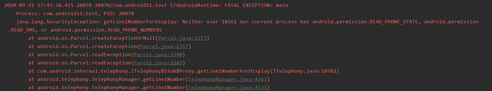

# 电话号码权限

Android 11主要改动就是要使用下列两个方法时

1. TelephonyManager 类和 TelecomManager 类中的 getLine1Number() 方法。

1. TelephonyManager 类中不受支持的 getMsisdn() 方法。

READ_PHONE_STATE权限不管用了，需要READ_PHONE_NUMBERS权限才行。
```
<manifest>
    <!-- Grants the READ_PHONE_STATE permission only on devices that run
         Android 10 (API level 29) and lower. -->
    <uses-permission android:name="READ_PHONE_STATE"
                     android:maxSdkVersion="29" />
    <uses-permission android:name="READ_PHONE_NUMBERS" />
</manifest>
```
使用以下代码在android 11模拟器上获取电话号码
```

    private fun getPhoneNumber() {
        if (ContextCompat.checkSelfPermission(context!!, Manifest.permission.READ_PHONE_STATE) != PackageManager.PERMISSION_GRANTED) {
            ActivityCompat.requestPermissions(activity!!,
                    arrayOf(Manifest.permission.READ_PHONE_STATE), 100)
        } else {
            val tm = context?.applicationContext?.getSystemService(Context.TELEPHONY_SERVICE) as TelephonyManager
            val phoneNumber = tm?.line1Number
            Toast.makeText(context, phoneNumber, Toast.LENGTH_LONG).show()
        }
    }
```

直接闪退


把READ_PHONE_STATE改成READ_PHONE_NUMBERS就可以获取成功